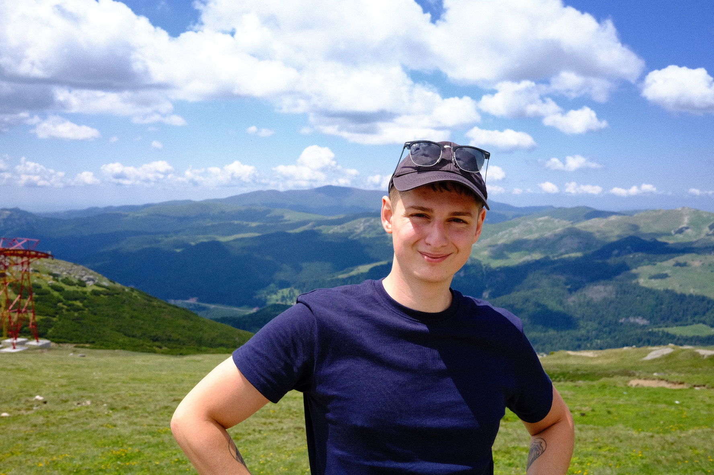

Hi! I'm Andrei Alexandru. I'm passionate about making the future go well for humans, especially in light of increasing AI capabilities. I look like this:

## Background
My background is in Computer Science. After I graduated, I worked in Fintech for 4 years, and mostly decided that it wasn't for me. I then did an MPhil in Machine Learning at the University of Cambridge, where I wrote my dissertation on the inductive biases of shallow neural networks. I am planning on writing some of my research up as blog posts, and uploading it here.

## Interests
My main interests are machine learning and technical AI safety research. The latter refers to the idea of ensuring that advanced AI systems actually do what humans want, which turns out to not be trivial. A good introduction to AI safety research, which is sometimes called alignment research, is [The Alignment Problem](https://brianchristian.org/the-alignment-problem/).

Within safety research, I'm interested in how the inductive biases of neural networks affect the difficulty of the alignment problem. I'm also interested in interpretability of neural networks as a strategy for detecting malicious systems. I'm generally still mapping out the space and trying to form an inside view of the potential strategies we could use to solve alignment.

I care about AI going well because I believe it will determine the welfare of very many future lives. I am concerned about existential risk – the risk that some events, including emerging technologies like AI have the capacity to destroy the human race, or drastically curtail its potential (to find out more about x-risk, have a look at [The Precipice](https://theprecipice.com/)). I also believe that it's important to have safe AI systems even before they pose existential risks, because failing to do so may lead to disproportionate negative impacts on minorities, or destabilisation of democratic elections.

## What I am currently up to
I'm currently in the SF Bay Area, participating in two research/engineering programmes: the Machine Learning for Aligmment Theory Scholarship from the Stanford Existential Risk Initiative, and the ML for Alignment Bootcamp organised by Redwood Research. 

## Trivia
No About page is complete without facts of various degrees of utility:
- I'm left-handed, and I have a scar on my left thumb from shooting myself with an arrow as a teen.
- I'm generally a sporty person, and it seems that I enjoy variety more than sticking with any single sport. I've played/done/engaged to some degree with football, touch rugby, kickboxing, tennis, table tennis, rock climbing and cycling. I mostly cycle and climb these days.
- I consider myself an effective altruist: a person who is attempting to maximise their positive impact on the world through their work. 
- I'm interested in productivity, and ways to use computers as tools for thought. I like the ideas of Alan Kay, Doug Engelbart and Bret Victor. I use Notion every day, and have tried Roam and Obsidian. (I left Evernote some years ago and never looked back.)
- I'm really into perfumes, and tend to go on rants about fragrances I like. I wear Kouros a lot, my current favourite is Durga from DS & Durga, and I'm really proud to have picked up one of the last bottles of Oud de Nil from Penhaligon.
- My favourite fiction author is David Foster Wallace. If you don't have time for Infinite Jest, read "Federer, both flesh and not".
