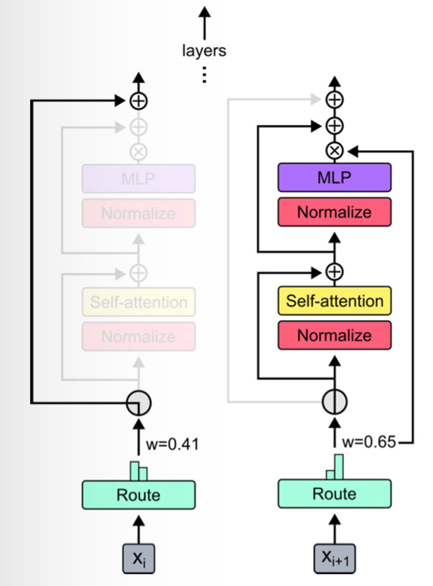
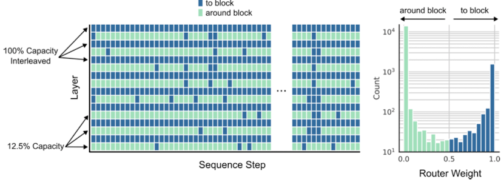
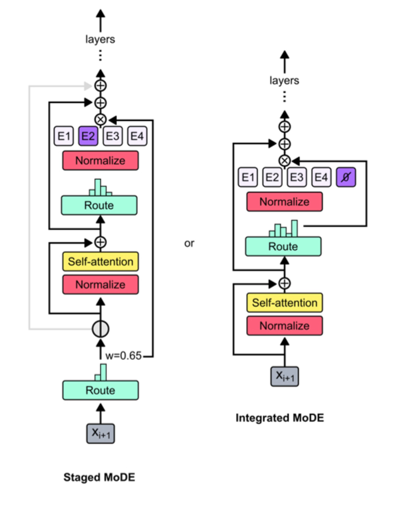

Google Deepmind recently released this paper: [Mixture-of-Depths: Dynamically allocating compute in transformer-based language models](https://arxiv.org/abs/2404.02258).

tl;dr: relative to a vanilla transformer, you can train either (a) higher-performance or (b) same performance, but faster to run models using a technique called mixture-of-depths. Conceptually, the change is straightforward: for each transformer block, learn a routing mechanism that determines whether a given token goes through the block, or skips it – as in a residual connection. 

## Setting the stage
If you've been watching the machine learning space in the last 5 years or so, you'll have noticed language models becoming near-ubiquitous. And for good reason! They're unreasonably effective at general purpose tasks, so long as you can scale them and the datasets they're trained on to be large enough. We now also have a set of post-training techniques that make them even more capable and useful to end-users – RLHF, SFT on downstream tasks, prompting techniques – making them useful as chatbots, coding assistants, and other applications we haven't dreamt of yet.

But the scaling part is kind of a big deal. The largest models in production today probably cost >$100m to train, and have a non-negligible cost to re-train. This cost is a combination of training very large models (100s of billions of parameters) on very large datasets (10s of *trillions* of tokens) and likely for very many epochs. On one hand, these figures are likely going down, because hardware improvements (think NVIDIA's latest GTC) and algorithmic progress (making the models themselves "easier to train") are chipping away at compute costs. On the other, there's higher demand for GPUs, we're training more and more complex systems, and there's an increasing number of companies wanting to explore what LLMs can do for them. If you can bring down the compute cost of training and serving a large language model, the entire ecosystem benefits.

## Mixture of depths
The starting intuition for the [Raposo et al. 2024](https://arxiv.org/abs/2404.02258) paper is that not all tokens should take the same amount of compute or time when making a prediction. Some are more important than others (we know this because self-attention works well) so we can try to translate this into compute efficiency gains.

The term of art here is "conditional computation", the gist of which is that you can reduce total compute used by only expending it when needed, e.g. see [Bengio et al. 2016](https://arxiv.org/abs/1511.06297). One problem with this is that it leads to dynamic computation graphs – that is, we might not know in advance how much compute we need when we apply conditional computation. This is bad because in large scale ML systems we want to maximise hardware utilisation, preferably knowing in advance how much memory, bandwidth etc. we're going to need for a particular computation.

So instead of having a dynamic computation graph, let's pre-specify a total compute budget, which doesn't change during training, so that hardware is leveraged as much as possible. We can tie this budget to the number of tokens in a sequence that can participate in a transformer block's computations – let's say $k$ of $T$ total tokens.

Given this fixed budget, let's get transformers to learn to dynamically allocate compute to each input token, in each layer, i.e. which $k$ of the $T$ total tokens will participate in each block. Because not all tokens are used, the number of FLOPs used is lower than a vanilla transformer.

The way you do this is through a routing mechanism: moving down through the network layers, each token either has the layer applied to it (just like a vanilla transformer, no changes there) or it passes through a residual connection (i.e. no computation is applied to it). The routing applies to entire transformer blocks, which comprise one attention layer, and one MLP.

Routing is controlled by per-block routers – these generate a scalar weight for each token, the intuition for which is that router's "preference" for the token to participate in the computation. Given a bunch of these preference weights, identify the $k$ highest of them and select those tokens to participate in the block.

## Routing tokens
How do you route tokens in practice? 

You could do it stochastically by sampling the routing weights from a normal distribution - this turns out not to work so well - or you could learn the weights of the router as part of regular training. 

Specifically, let's say you have a set of token embeddings for a sequence of length $S$ in layer $l$, $X^l = \{x_i^l | i = \overline{1, S}\}$.

Give each token embedding a router weight generated by a linear projection: $$r_i^l = w_\theta^T x_i^l$$

Now taking $P_\beta(R^l)$ as the $\beta$-th percentile of the set of router weights $R^l$, where $\beta = 1 - \frac{k}{S}$, each block's output for a given token is:
$$x_i^{l+1} = \begin{cases} 
r_i^lf_i(\tilde X^l) + x_i^l, \quad \text{if}\ r_i^l > P_\beta(R^l) \\
x_i^l, \quad\quad\quad\quad\quad\ \ \ \text{if}\  r_i^l < P_\beta(R^l)

\end{cases}$$
In short:
- we use the percentile to pick the top-k tokens;
- the $f_i$ function corresponds to the transformer block; 
- the $\tilde X$ vector corresponds to the tokens that this token depends on (because of attention) – there are $k$ of them;
- we multiply the block output by the router weight so that the latter gets added to the computational graph and acted on during backprop, taking gradients with respect to this parameter just like we do with others;

I think this is a pretty clean solution – it's mathematically unsophisticated, and seems to work well in practice! There is just one *small* snag: when we use the top-$k$ weights to determine which tokens take part in a block, the decision for a token $x_i$ depends on tokens that follow it, like $x_{i+1}, x_{i+2}$ and so on! After all, the routing mechanism might just prefer them more. 

This breaks autoregressive sampling, i.e. where we generate one token, then we use it to generate another, and another, left-to-right. One solution to this is to add a second classifier to each router to try and predict whether given a token as input that token will be in the top-$k$ or not. 

## Results
It's a good idea to go read the original paper for a nuanced interpretation of the results, but a few things seem worth mentioning here:
1. Optimal mixture-of-depths (MoD) transformers get lower loss than optimal baselines (i.e. optimal-compute trained vanilla transformers), and they have more parameters. This means you can either have models which for the same compute cost have lower loss/higher performance, or you can have smaller, cheaper models that have the same loss as a more expensive, larger baseline!

    One way to look at this is that for a given wall-clock time spent during training, an MoD model will get more training steps in than a vanilla model, because each step takes less time. So the MoD model trains for longer!

2. The best MoD variant they found routed every other block (and left other block as in vanilla transformers), and used (by my lights) *super* aggressive top-k choices: only 12.5% of all tokens got processed by the routed blocks! That means 87.5% get skipped by every other transformer block.

3. You can combine mixture-of-depths and mixture-of-experts models to get an even handier acronym: MoDE. There's two architecture ideas, one of which seems to work better than the other.

## Wrapping up
I like the simplicity of the routing; lots of great ideas seem obvious in retrospect! It's an inexpensive intervention that reduces compute cost and lets us train better models. The flip-side of this is that we should evaluate any downstream impact before this gets widely rolled out – does it change model behaviour in any way? 