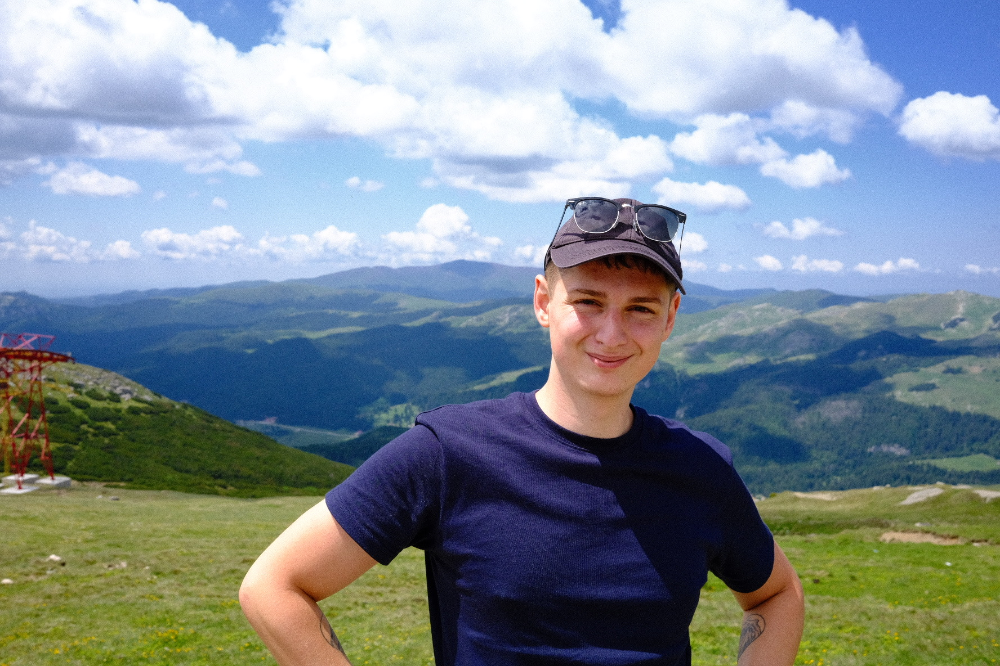

Hi! I'm Andrei Alexandru. I'm passionate about making the future go well for humans, especially in light of increasing AI capabilities. I look like this:

## Background
My background is in Computer Science. After I graduated, I worked in Fintech for 4 years, and mostly decided that it wasn't for me. I then did an MPhil in Machine Learning at the University of Cambridge, where I wrote my dissertation on the inductive biases of shallow neural networks. I am planning on writing some of my research up as blog posts, and uploading it here.

## Interests
My main interests are machine learning and technical AI safety research. The latter refers to the idea of ensuring that advanced AI systems actually do what humans want, which turns out to not be trivial. A good introduction to AI safety research, which is sometimes called alignment research, is [The Alignment Problem](https://brianchristian.org/the-alignment-problem/).

Within safety research, I'm interested in how the inductive biases of neural networks affect the difficulty of the alignment problem. I'm also interested in interpretability of neural networks as a strategy for detecting malicious systems. I'm generally still mapping out the space and trying to form an inside view of the potential strategies we could use to solve alignment.

I care about AI going well because I believe it will determine the welfare of very many future lives. I am concerned about existential risk – the risk that some events, including emerging technologies like AI, have the capacity to destroy the human race, or drastically curtail its potential (to find out more about x-risk, have a look at [The Precipice](https://theprecipice.com/)). I also believe that it's important to have safe AI systems even before they pose existential risks, because failing to do so may lead to disproportionate negative impacts on minorities, or destabilisation of democratic elections.

As of early 2024, some of these concepts have become polarised within AI and tech circles, which is unfortunate for the quality of the discourse. Also, many of these conversations seem to happen on Twitter, which isn't the best medium for thoughtful, nuanced debate. I've mostly stayed out of picking sides (e.g. accelerationists vs. decelerationists) – I'm a fan of [keeping one's identity small](https://paulgraham.com/identity.html) – but perhaps it's worth clearing up my stance.

I'm genuinely excited about technology that improves people's lives. I get a sense of joy when people find tools that make their day-to-day better, that enable them to do new things, or to think in new ways. Science, tech and manufacturing breakthroughs in the last century or so have largely transformed our lives, and mostly for the better. I am optimistic that we're not done yet, and that humanity can continue to thrive. Progress continues in AI, biotech, renewable energy – these and other exciting areas are full of smart, driven, capable folks, working to build the future.

As these developments continue, I want to be mindful of their impact on society and our environment. I want to be clear-eyed about what I'm building, and aware of hidden incentives. I don't want to contribute to technology which causes clear harm, or has a high risk of dual use. I recognise that this is difficult, and I'll try to navigate this as best as I can.

## What I am currently up to
Have a look at my [now page](now.md).

## Trivia
No About page is complete without facts of various degrees of utility:
- I'm left-handed, and I have a scar on my left thumb from an archery accident as a teen.
- I'm generally a sporty person, and it seems that I enjoy variety more than sticking with any single sport. I've played/done/engaged to some degree with football, touch rugby, kickboxing, tennis, table tennis, hiking, rock climbing and cycling. I mostly cycle and climb these days. 
- I consider myself an effective altruist: a person who is attempting to maximise their positive impact on the world through their work. 
- I'm interested in productivity, and ways to use computers as tools for thought. I like the ideas of Alan Kay, Doug Engelbart and Bret Victor. I use Notion every day, and have tried Roam and Obsidian. (I left Evernote some years ago and never looked back.)
- I'm really into perfumes, and tend to go on rants about fragrances I like. I wear Kouros a lot, my current favourite is Durga from DS & Durga, and I'm really proud to have picked up one of the last bottles of Oud de Nil from Penhaligon.
- My favourite fiction author is David Foster Wallace. If you don't have time for Infinite Jest, read "Federer, both flesh and not".

## Reaching out
You can email me at andrei [at] inwaves.io. I'm also on [LinkedIn](https://www.linkedin.com/in/aalexaa/), [Github](https://github.com/inwaves) and [LessWrong](https://www.lesswrong.com/users/inwaves).

## About this site
This is a static site built with Jekyll on Github Pages. The theme is [Chirpy](https://github.com/cotes2020/jekyll-theme-chirpy/).